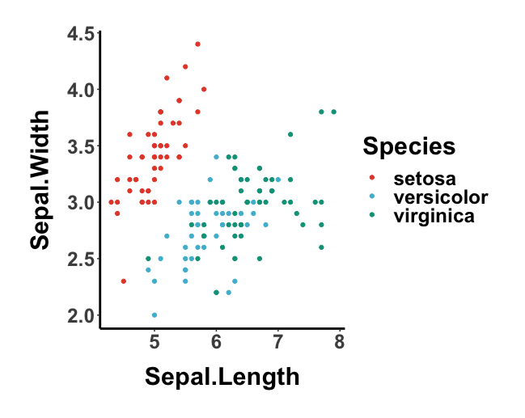

# ggensentials

My ggplot2 essential configurations used for paper figures.

```r
library(ggessentials)

## preset the theme
geUseTheme('classic')
## to get a list of colors (1-17)
colors <- geGetColors(3)

data("iris")
ggplot(iris, aes(x=Sepal.Length, y=Sepal.Width, color=Species)) + 
    geom_point() +
    scale_color_manual(values=colors)
```


