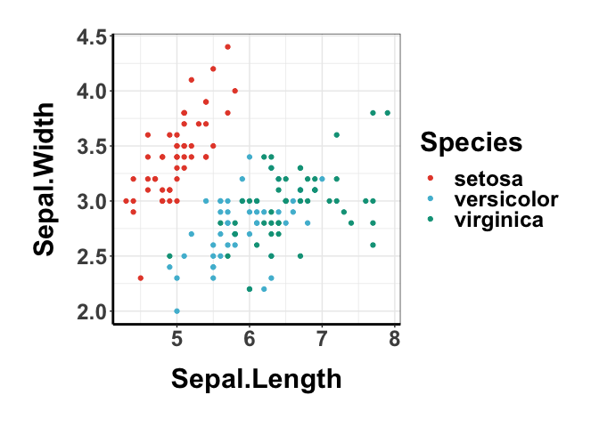
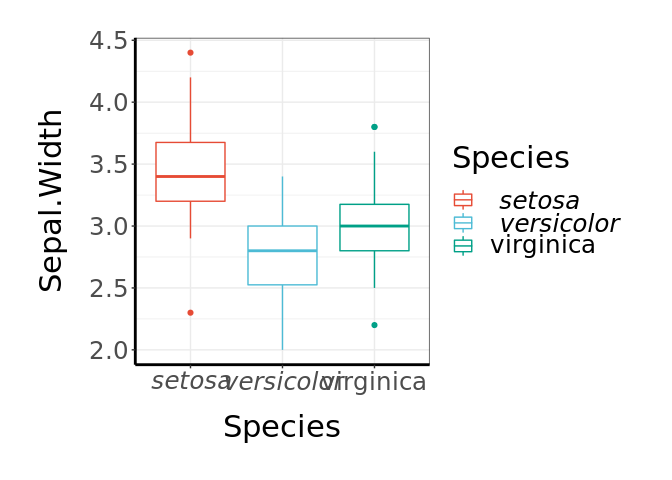
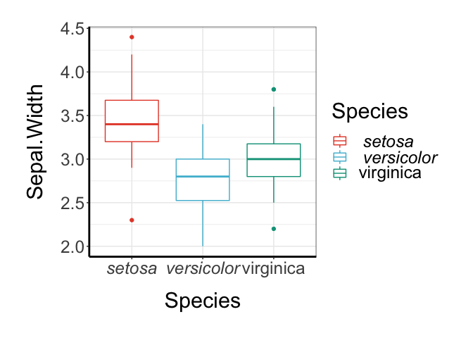
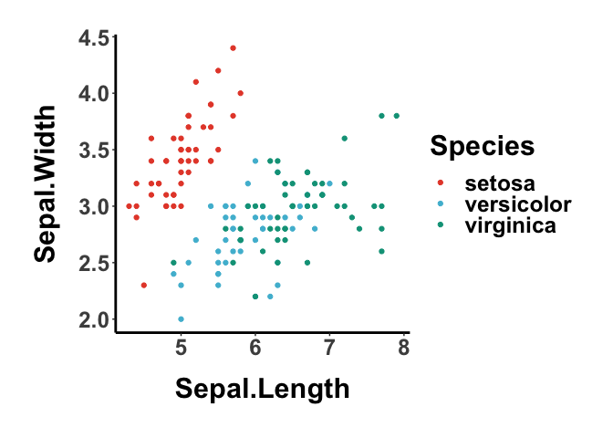
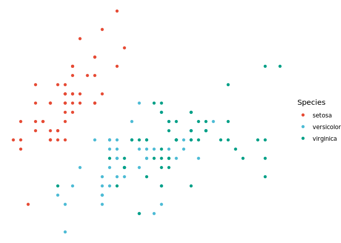
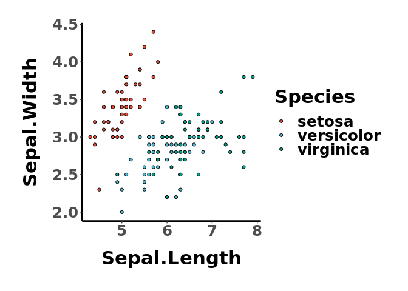

## ggessentials: My ggplot2 essential configurations used for paper figures.

### Functions

  - `geUseTheme`: use a preset theme for plotting (support `bw` or
    `classic` at the moment)
  - `geGetColors`: get a vector of colors
  - `italicize.string`: italicize strings in a sentence
  - `italicize.plot`: italicize strings in a ggplot

Known issues with `italicize.plot`:

  - overwrites bold font face

### Aesthetics

  - `scale_color_ge`/`scale_fill_ge`: selected color scheme

### Themes

  - `theme_bw_ge`
  - `theme_classic_ge`

### Installation

``` r
devtools::install_github("lch14forever/ggessentials")
```

### Usage

``` r
library(ggessentials)

## to get a list of colors (1-17)
colors <- geGetColors(3)

data("iris")
ggplot(iris, aes(x=Sepal.Length, y=Sepal.Width, color=Species)) + 
    geom_point() +
    scale_color_manual(values=colors) +
    theme_bw_ge()
```

<!-- -->

#### Italicize a taxon name in a plot

``` r
p <- ggplot(iris, aes(x=Species, y=Sepal.Width, color=Species)) + 
    geom_boxplot() +
    scale_color_manual(values=colors) +
    theme_bw_ge()

g <- italicize.plot(p, string = c('setosa', 'versicolor'))
```

<!-- -->

``` r
plot(g)
```

<!-- -->

#### Set theme for the current session

``` r
## preset the theme
geUseTheme('classic')
ggplot(iris, aes(x=Sepal.Length, y=Sepal.Width, color=Species)) + 
    geom_point() +
    scale_color_manual(values=colors)
```

<!-- -->

#### Disrete color scale with `scale_color_ge` or `scale_fill_ge`

``` r
ggplot(iris, aes(x=Sepal.Length, y=Sepal.Width, color=Species)) + 
    geom_point() +
    scale_color_ge()
```

<!-- -->

``` r
ggplot(iris, aes(x=Sepal.Length, y=Sepal.Width, fill=Species)) + 
    geom_point(shape=21) +
    scale_fill_ge()
```

<!-- -->
