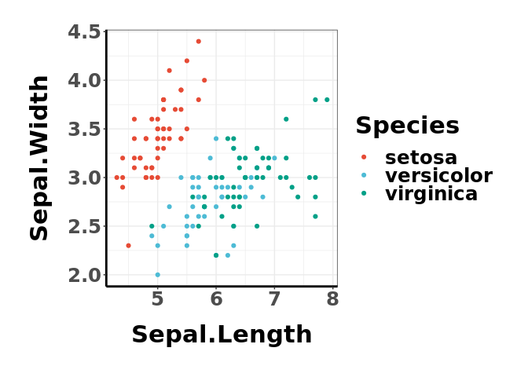
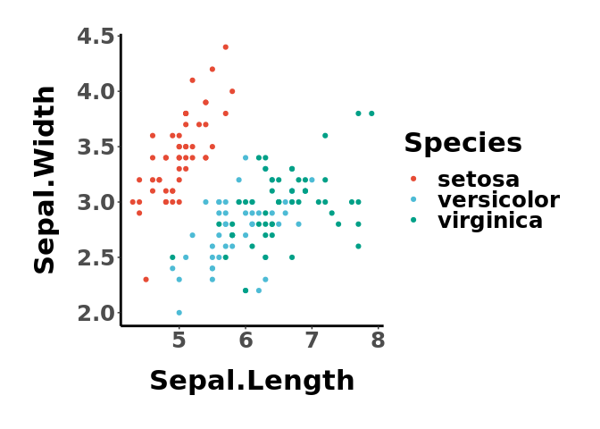

## ggessentials: My ggplot2 essential configurations used for paper figures.

### Functions

  - `geUseTheme`: use a preset theme for plotting
  - `geGetColors`: get a vector of colors

### Aesthetics

  - `scale_color_ge`/`scale_fill_ge`: selected color scheme

### Installation

``` r
devtools::install_github("lch14forever/ggessentials")
```

### Usage

``` r
library(ggessentials)

## preset the theme
geUseTheme('classic')
## to get a list of colors (1-17)
colors <- geGetColors(3)

data("iris")
ggplot(iris, aes(x=Sepal.Length, y=Sepal.Width, color=Species)) + 
    geom_point() +
    scale_color_manual(values=colors)
```

<!-- -->

#### Disrete color scale with `scale_color_ge` or `scale_fill_ge`

``` r
ggplot(iris, aes(x=Sepal.Length, y=Sepal.Width, color=Species)) + 
    geom_point() +
    scale_color_ge()
```

<!-- -->

``` r
ggplot(iris, aes(x=Sepal.Length, y=Sepal.Width, fill=Species)) + 
    geom_point(shape=21) +
    scale_fill_ge()
```

<!-- -->
