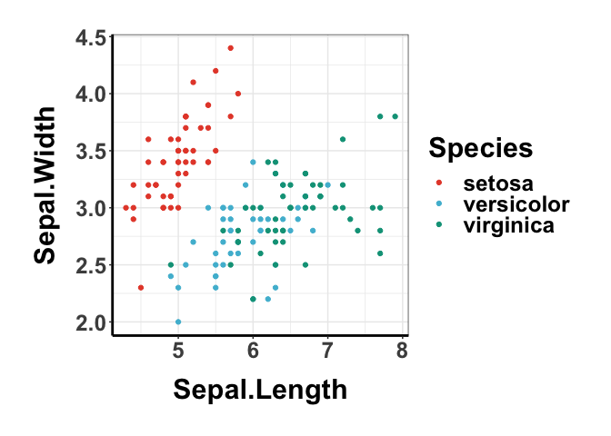
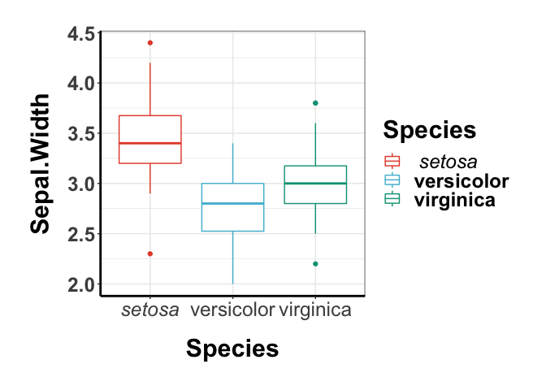
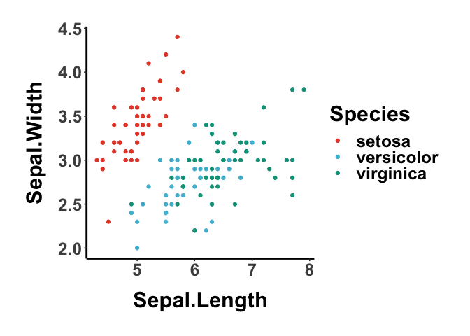
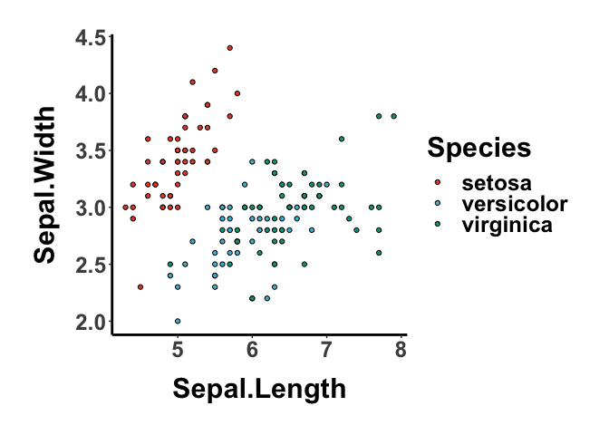

ggessentials: My ggplot2 essential configurations used for paper figures.
-------------------------------------------------------------------------

### Functions

-   `geUseTheme`: use a preset theme for plotting (support `bw` or
    `classic` at the moment)
-   `geGetColors`: get a vector of colors
-   `italicize.string`: italicize strings in a sentence
-   `italicize.plot`: italicize strings in a ggplot

Known issues with `italicize.plot`: - does not support bold font face -
create multiple legend guides - supported elemnets: axis labels, axis
names, color, fill

### Aesthetics

-   `scale_color_ge`/`scale_fill_ge`: selected color scheme

### Themes

-   `theme_bw_ge`
-   `theme_classic_ge`

### Installation

    devtools::install_github("lch14forever/ggessentials")

### Usage

    library(ggessentials)

    ## to get a list of colors (1-17)
    colors <- geGetColors(3)

    data("iris")
    ggplot(iris, aes(x=Sepal.Length, y=Sepal.Width, color=Species)) + 
        geom_point() +
        scale_color_manual(values=colors) +
        theme_bw_ge()

#### Italicize taxon name in a plot

    p <- ggplot(iris, aes(x=Species, y=Sepal.Width, color=Species)) + 
        geom_boxplot() +
        scale_color_manual(values=colors) +
        theme_bw_ge()
    italicize.plot(p, 'setosa')

#### Set theme for the current session

    ## preset the theme
    geUseTheme('classic')
    ggplot(iris, aes(x=Sepal.Length, y=Sepal.Width, color=Species)) + 
        geom_point() +
        scale_color_manual(values=colors)

#### Disrete color scale with `scale_color_ge` or `scale_fill_ge`

    ggplot(iris, aes(x=Sepal.Length, y=Sepal.Width, color=Species)) + 
        geom_point() +
        scale_color_ge()

    ggplot(iris, aes(x=Sepal.Length, y=Sepal.Width, fill=Species)) + 
        geom_point(shape=21) +
        scale_fill_ge()

